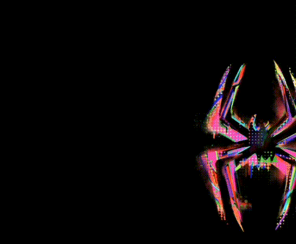

<!-- Spider-Verse Header with Overlapping Terminal -->

  <!-- Background GIF -->
  
  
  <!-- Overlapping Terminal GIF -->
  

    
  

---

##  **Let's play Chessssss**

### *Make your move by creating an issue*

<!-- Chess Board Section -->

|   | A | B | C | D | E | F | G | H |   |
|---|---|---|---|---|---|---|---|---|---|
| **8** |  |  |  |  |  |  |  |  | **8** |
| **7** |  |  |  |  |  |  |  |  | **7** |
| **6** |  |  |  |  |  |  |  |  | **6** |
| **5** |  |  |  |  |  |  |  |  | **5** |
| **4** |  |  |  |  |  |  |  |  | **4** |
| **3** |  |  |  |  |  |  |  |  | **3** |
| **2** |  |  |  |  |  |  |  |  | **2** |
| **1** |  |  |  |  |  |  |  |  | **1** |
|   | **A** | **B** | **C** | **D** | **E** | **F** | **G** | **H** |   |

**It's your move! You're playing as Black.**

###  How to Play

1. **Create a new issue** titled with your move in [chess notation](https://en.wikipedia.org/wiki/Algebraic_notation_(chess))
   - Examples: `e2 to e4`, `Nf3`, `O-O` (castling)
2. **Wait for validation** - The bot will check if your move is legal
3. **Watch the board update** - If valid, I'll make my move and the board updates automatically!

**[ Make Your Move →](https://github.com/Shaptain/Shaptain/issues/new?title=chess%7Cmove)**

---

##  **LeetCode Stats**

---

### 🕷️ *"With great code comes great responsibility"*

